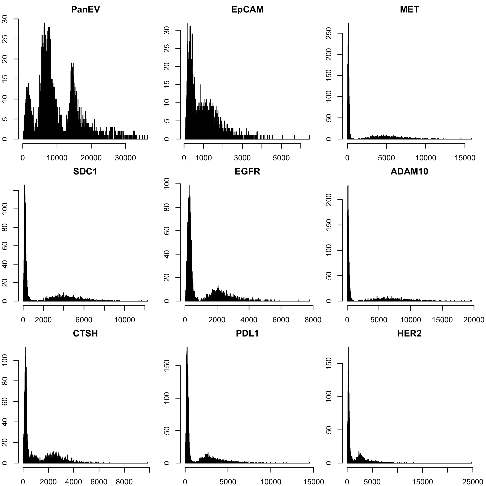
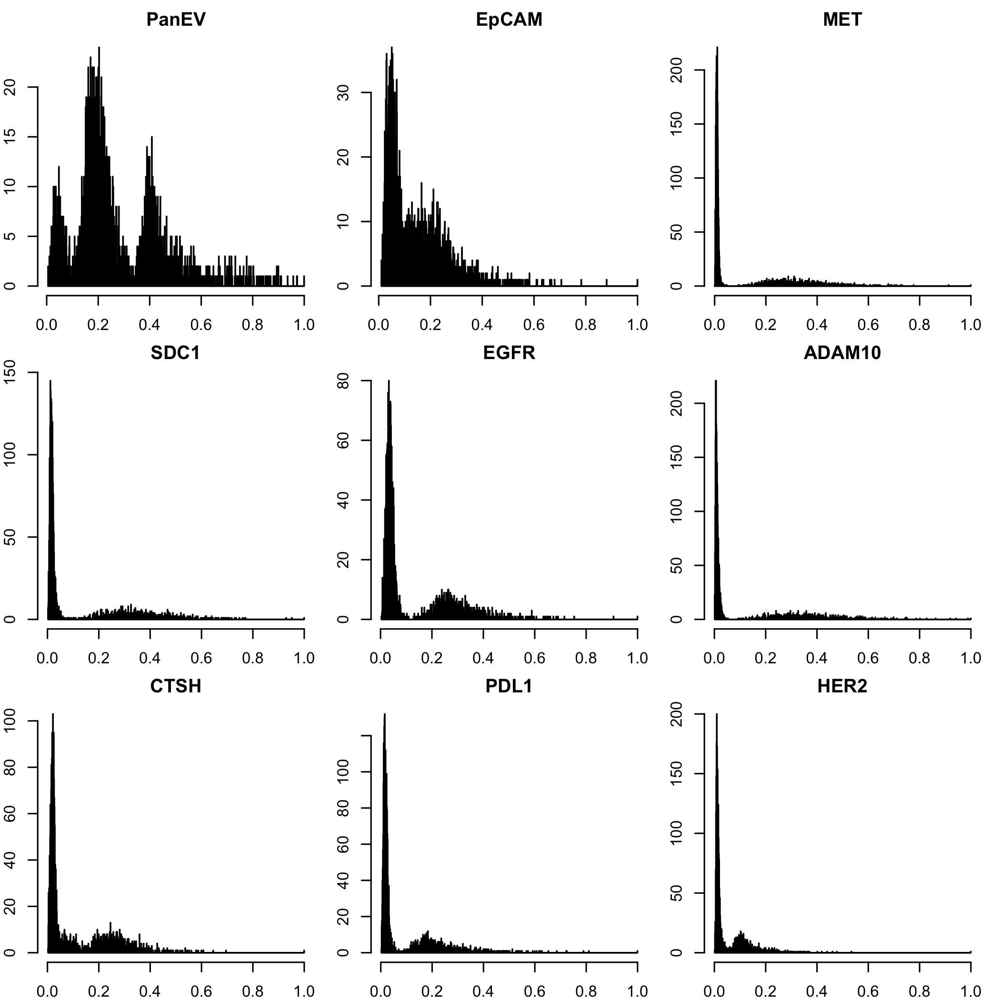
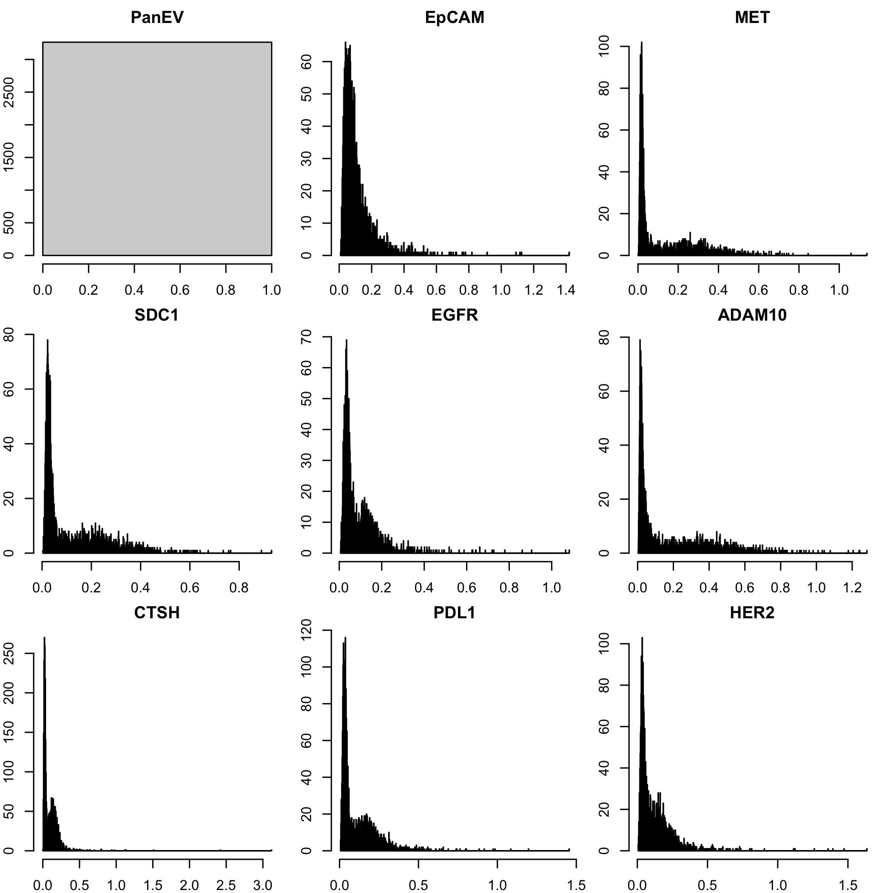
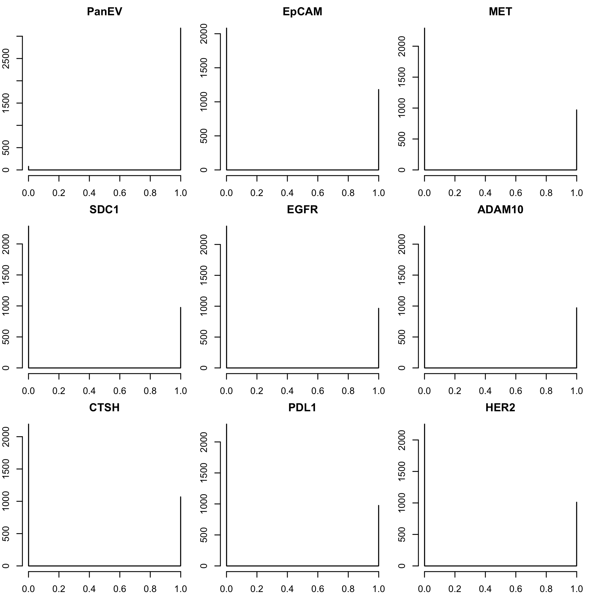
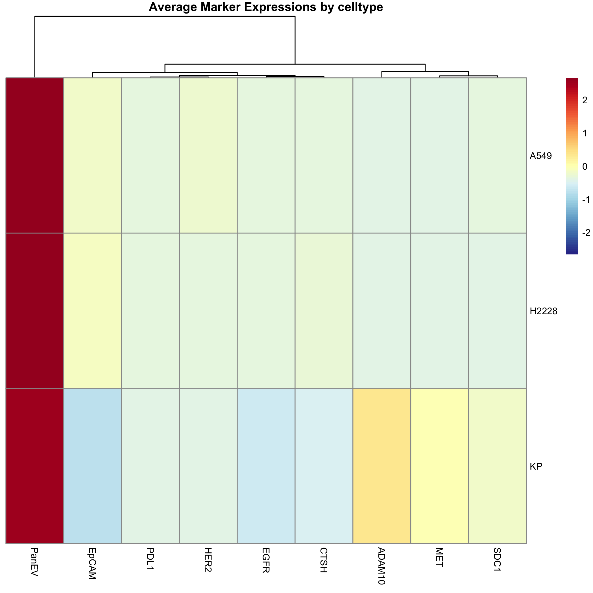
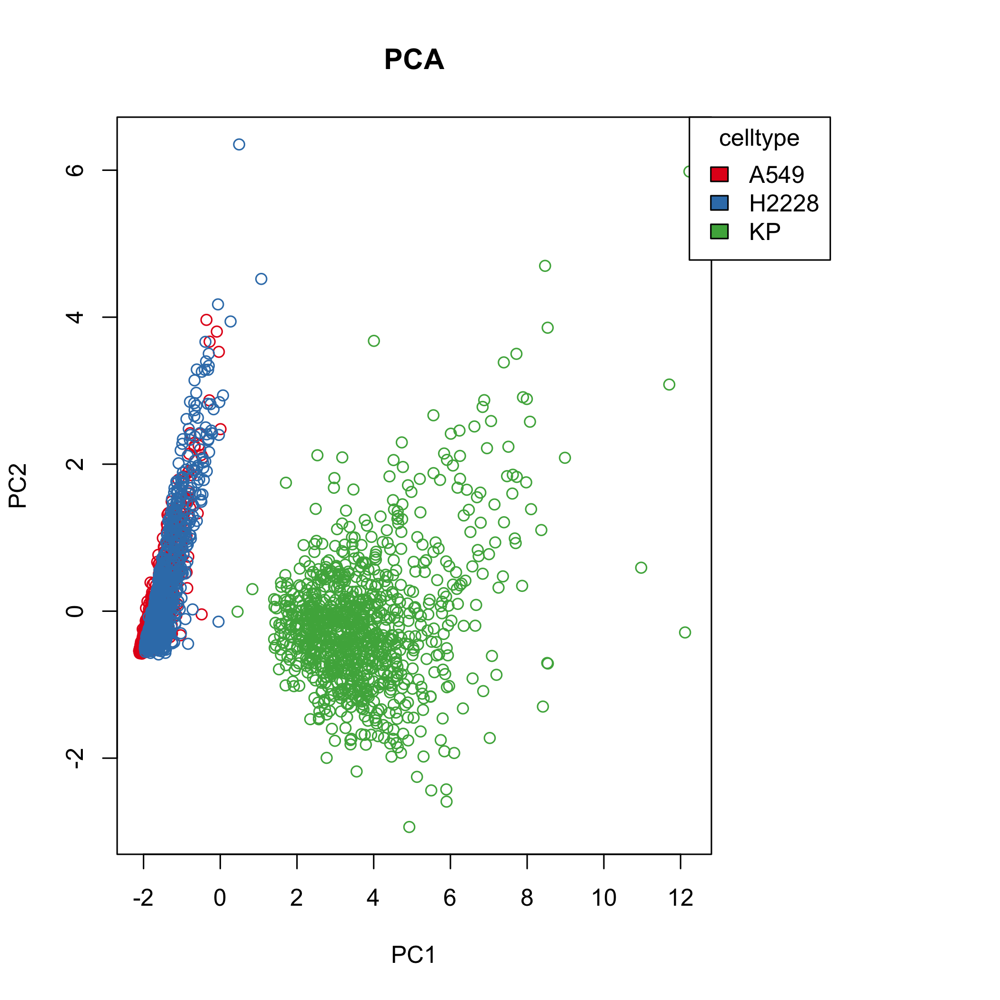
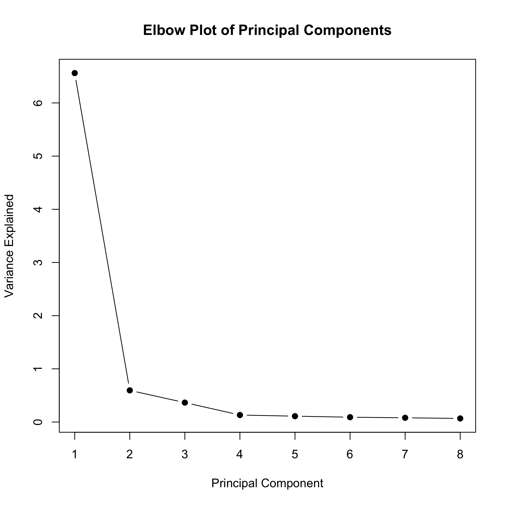

## Cygnus Example Analysis - A Quick Tutorial

This tutorial covers reading a processed input file from AIVIA to generate an example report and 3D plots required for interactive data visualization. The instructions for package installation can be found <a href=https://yeinchung.github.io/Cygnus/>here</a>.

For the purpose of this tutorial, we will be using an example data from KP1.9 cell line derived extracellular vesicle imaging data. The data can be downloaded here.


``` r
library(Cygnus)
library(viridis)
library(plotly)
```

Creating Cygnus object requires the user to specify metadata and markers column from the input .csv file. This can be done through an interactive Shiny App.


``` r
data.path <- "../inst/extdata/all_cells.csv" 
# cyg <- CreateCygnus(data.path) # this starts the interactive app

cyg <- CreateCygnus(data.path,
                    markers_col = c("PanEV", "EpCAM", "MET",
                                    "SDC1", "EGFR", "ADAM10",
                                    "CTSH", "PDL1", "HER2" ),
                    meta_col = "celltype")

cyg
```

```
## Summary of CygnusObject:
## Slot: [1] "Raw_Score"
## Numer of EVs: [1] 3264
```

If any metadata from another file need to be added, you can do so with the following code:


``` r
cyg@ev_meta[['type']] <- "cell_line"
```

Cygnus allows iterative analysis, where the results from each step of analysis is stored in the same object. This is especially useful for data sharing.

Currently, the object has one matrix, "Raw_Score", which is the default matrix that stores the initial input matrix of the CygnusObject. The object contains 755 EVs. Please note that Cygnus is a scalable workflow, and can run with samples with \>10,000 EVs.


``` r
plotDistribution(cyg)
```



\n From the above distribution, you can see that the range of intensities of markers differ. Sometimes this difference arises from differences in antibody affinity, rather than reflecting a meaningful biological signal. Therefore, we offer an optional function that creates another layer to scale the expressions.


``` r
cyg <- scaleExpressionMatrix(cyg)
plotDistribution(cyg, matrix = "scaled_exp_matrix")
```



\n PanEV is used to localize EVs in the original imaging data, and is generally not useful for biological interpretation. However, EVs with greater PanEV expression may be larger in size. This can lead to EVs with greater size aggregating together when clustered. This function also adds a new matrix to the object, which can be viewed with *names([cyg\@matrices](mailto:cyg@matrices){.email})*.


``` r
cyg <- normalizeByPanEV(cyg, "PanEV") 
plotDistribution(cyg, matrix = "normalized_exp_mat")
```



\n Another normalization method uses the distribution of IgG (isotype control). This can be done with an interactive Shiny app.


``` r
# NEED TO BE UPDATED
```

This sets arbitrary cutoff

``` r
cyg <- createBinaryMatrix(cyg, thresholds = 1000)
plotDistribution(cyg, matrix = "binary_exp_matrix")
```



**Description of average heatmap**


``` r
plotAvgHeatmap(cyg, "celltype", scale = "row")
```



### Marker Analysis

**ADD DESCRIPTIONS**


``` r
# co localization (show venn and upset)
```


``` r
# customizing upset
```


``` r
# pairwise .....
```


``` r
# devience
```


``` r
# upset plot
```

### EV Analysis

**ADD DESCRIPTIONS**

``` r
cyg <- markRelevantMarkers(cyg, c("EpCAM", "MET",
                               "SDC1", "EGFR", "ADAM10",
                               "CTSH", "PDL1", "HER2")) 
```


``` r
cyg <- runPCA(cyg, matrix_name = "Raw_Score") 
plotPCA(cyg, color_by = "celltype")
```




``` r
plotElbowPlot(cyg)
```




